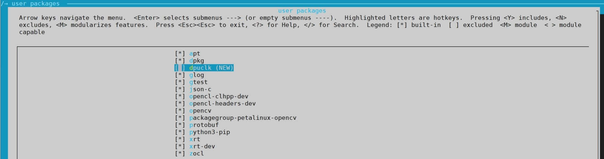
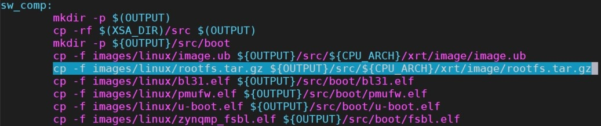
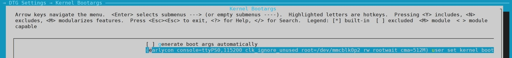
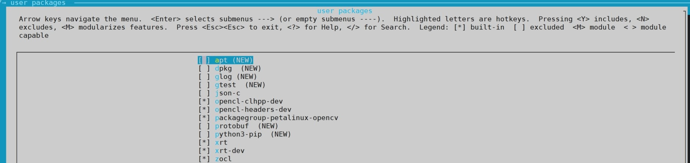
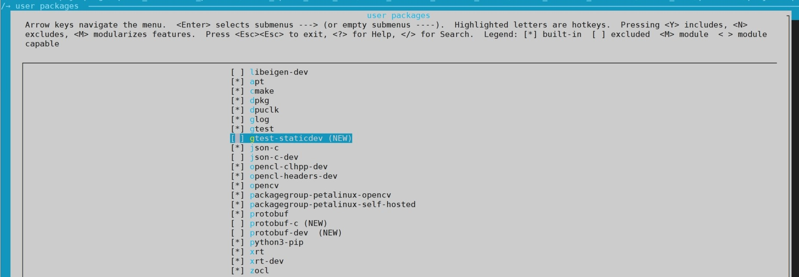

# Release Notes

***For ZCU102_DPU Platform and ZCU104_DPU Platform***

  - [Revision History of This Document](#revision-history-of-this-document)
  - [Platform General Info](#platform-general-info)
  - [Platform Introduction](#platform-introduction)
  - [Install Process](#install-process)
  - [Platform Specification](#platform-specification)
  - [Platform Source](#platform-source)
  - [Reference Design and Applications](#reference-design-and-applications)
  - [Known Issues](#known-issues)


## 1. Revision History of This Document

- 2/24/2020: v0.1, Initial beta release

## Platform General Info

- Platform Name: zcu102_dpu, zcu104_dpu
- Supported tool version: 2019.2
- Release Date: 2/17/2020
- Created by tool version: 2019.2
- Supported XRT version: 2019.2 (2.3.1301)
- Target Board: ZCU102, ZCU104

## Platform Introduction

Vitis platforms are the starting point of Vitis application acceleration designs. With a pre-built Vitis platform, user can compile acceleration kernels and link them with the platform. Vitis Embedded Platforms include hardware configurations and software configurations. More information could be found in [Vitis documentation](https://www.xilinx.com/html_docs/xilinx2019_2/vitis_doc/Chunk1927950541.html).

Xilinx provides some embedded platforms for users to quick start on Xilinx demo boards. Vitis Base platforms like [zcu102_base](../zcu102_base) are designed for general purpose acceleration use cases. Vitis DPU platforms like zcu102_dpu are optimized for [DPU](https://www.xilinx.com/support/documentation/ip_documentation/dpu/v3_1/pg338-dpu.pdf) performance. Software environment of DPU platforms are configured to enable Vitis-AI applications. 

Vitis DPU Platforms are derived from Vitis base platforms. Common features are not listed in this document. This document describes the unique features of `zcu102_dpu` and `zcu104_dpu` Vitis DPU platforms, how they are setup based on `zcu102_base` and `zcu104_base` Vitis base platforms, and explains why these settings are needed, majorly for demoing the performance showed in [DPU TRD](https://github.com/Xilinx/Vitis-AI/tree/master/DPU-TRD) 

All specification in this document for `zcu102_dpu` applies to `zcu104_dpu` as well. But not vice-versa because of the differneces between two boards.

## Install Process

Please refer to Vitis Document for detailed steps of [installing Vitis Embedded Platforms](https://www.xilinx.com/html_docs/xilinx2019_2/vitis_doc/Chunk1674708719.html)

## Platform Specification

This chapter documents the details of platform specifications in regards of hardware and software. Since Vitis DPU Platforms are derived from Vitis Base Platforms, a lot of basic configurations are identical. To prevent redundency, the identical parts are not repeated in this document.

Each of the specification below has a "requirement level" property. It's classified to three levels as below:

- Required: Mandatory features to achieve the intended objective of the Vitis DPU platforms. i.e. to be able to run the Vitis-AI applications.
- Recommended: Advanced features for performance optimization or flexibility. Not all of the Vitis-AI applications need them, but these settings will help the Vitis-AI applications run smoothly with best performance. 
- For Demo Only: Not required for general usage, only used for demo.

Items below are grouped by the targeted features in the Vitis DPU platforms with respect to Vitis Base platforms. For example, a feature that enables a new interface may end with enabling its driver and adding an application in rootfs to control some registers or peripherals. It will be grouped in Hardware - Interface, rather than the change of kernel driver and rootfs.

Here's a quick link table for all specifications.

| HW/SW | Class             | Specification Title                                                                                      | Requirement Level |
| ----- | ----------------- | ----------------------------------------------------------------------------------------------- | ----------------- |
| HW    | Interfaces        | [Enable USB Camera](#111-enable-usb-camera)                                                                       | For Demo Only     |
| HW    | PS Configuration  | [Tune ARM Clock Frequency for Best Performance](#121-tune-arm-clock-frequency-for-best-performance) | Recommended       |
| HW    | PS Configuration  | [Disable HPC Cache-Coherent](#122-disable-hpc-cache-coherent)                                       | Recommended       |
| HW    | PS Configuration  | [Adjust AXI QoS](#123-adjust-axi-qos)                                                               | Recommended       |
| HW    | PL Configuration  | [DPU Frequency Adjustment Tool](#131-dpu-frequency-adjustment-tool)                                 | For Demo Only     |
| SW    | PetaLinux Project | [Image Type Configuration](#211-image-type-configuration)                                           | Recommended       |
| SW    | PetaLinux Project | [Expand CMA for DPU](#212-expand-cma-for-dpu)                                                       | Recommended       |
| SW    | RootFS            | [Add Dependent Libraries to RootFS](#231-add-dependent-libraries-to-rootfs)                         | Required          |
| SW    | RootFS            | [Add Dependent Libraries to Sysroot](#232-add-dependent-libraries-to-sysroot)                       | Required          |
| SW    | RootFS            | [Enable Self-hosted Tools for Native Compile](#233-enable-self-hosted-tools-for-native-compile)     | For Demo Only     |
| SW    | RootFS            | [Enable OpenSSH](#234-enable-openssh)                                                               | For Demo Only     |


### 1. Hardware

#### 1.1 Interfaces

Besides the input interfaces described in zcu102_base platform, ZCU102 and ZCU104 DPU platform also supports:

##### 1.1.1 Enable USB Camera

Requirement Level: For Demo Only

USB camera could be used in most Vitis-AI demo applications. To enable USB camera, some additional kernel drivers need to be enabled.

Setup Steps:

Step 1: Copy bsp.cfg from `zcu102_dpu/petalinux/project-spec/meta-user/recipes-kernel/linux/linux-xlnx/bsp.cfg` to your platform project.

To test the `facedetect` app with a USB camera as input, run the following command after install all related Vitis-AI packages on target board:

```
/usr/share/XILINX_AI_SDK/samples/facedetect/test_video_face_detect_dense_box_640x360 0 >/dev/null 2>&1
```

This step often used to test whether your target board environment is correct or not.

#### 1.2. PS Configurations

##### 1.2.1 Tune ARM Clock Frequency for Best Performance

Requirement level: Recommended

By default, ARM processor clock speed is not set to highest in base platforms. Setting ARM clock speed to the highest speed can help software run faster on ARM cores.

For example, the default APU clock of the PS for ZCU102 board is being set as 1200 MHz.  The part on the ZCU102 board is ZU9EG (DA7) B1156 -2LE, for the -2 speed grade, the Max APU clock supported is 1333 MHz,  If you want to go with 1333 MHz, you can customize the `zcu102_dpu/vivado/zcu102_dpu_xsa.tcl` file like below:

```
CONFIG.PSU__CRF_APB__ACPU_CTRL__ACT_FREQMHZ {1333} \
CONFIG.PSU__CRF_APB__ACPU_CTRL__DIVISOR0 {1} \
CONFIG.PSU__CRF_APB__ACPU_CTRL__FREQMHZ {1333} \
CONFIG.PSU__CRF_APB__ACPU_CTRL__SRCSEL {APLL} \
CONFIG.PSU__CRF_APB__ACPU__FRAC_ENABLED {1} \
```

Meanwhile, DTS also need update with frequency changes in PetaLinux to enable 1333MHz.


##### 1.2.2 Disable HPC Cache-Coherent

Requirement level: Recommended

When HPC0 or HPC1 ports is used to connect DPU IP(data port), it's recommended to disable HPC hardware cache-coherency, which could reduce latency on HPC port, while DPU doesn't take advantage of cache-coherent mode.

There are two steps to disable it:

Step 1: Set the "CCI enable" in zu+ PS to false(in 2019.2 it's default)

Setup 2: Label the HPC ports with the type S_AXI_HP, instead of S_AXI_HPC in `zcu102_dpu/vivado/zcu102_dpu_xsa.tcl` (see below example)

```
S_AXI_HPC0_FPD {memport "S_AXI_HP" sptag "HPC0" memory "ps_e HPC0_DDR_LOW"}
```

**NOTE**: This change is not applied to `zcu102_dpu` and `zcu104_dpu` source code and pre-built. User can apply this change to custom platforms depends on requirements.

##### 1.2.3 Adjust AXI QoS

Requirement Level: Recommended

Before DPU applications, changing the Quality of Service (QoS) settings is recommended to change the priority of any AXI port that DPU uses to read/write data because DPU is memory bandwidth hungry. Adjusting AXI QoS will help with bandwidth related issues. 

After Linux boots up, running the following commands can adjust QoS settings:  (take HP0 port for example:)

```bash
#Changing the QoS settings and the command issuing capabilities of the AXI HP0 ports to
#the DPU must be modified to avoid traffic congestion with respect to Display port in case of
#DPU and display use-case. If the QoS settings are not modified, the DisplayPort transmission
#may under-run, producing green or black frames intermittently during DPU running. 
 
#Set the S_AXI_HP0_FPD RDQoS (AFIFM) register to LOW_PRIORITY
#Set the S_AXI_HP0_FPD WRQoS (AFIFM) register to LOW_PRIORITY
 
devmem 0xFD380008 w 0x3
devmem 0xFD38001C w 0x3
  
#Increase the read and write issuing capability of the port connected to S_AXI_HP0_FPD.
#By default, it can take a maximum of four requests at a time, and increasing the issuing
#capability may keep the ports busy with always some requests in the queue.
  
#Set the S_AXI_HP0_FPD RDISSUE (AFIFM) register to allow 16 commands
#Set the S_AXI_HP0_FPD WRISSUE (AFIFM) register to allow 16 commands
  
devmem 0xFD380004 w 0xF
devmem 0xFD380018 w 0xF
```


#### 1.3 PL Configurations

##### 1.3.1 DPU Frequency Adjustment Tool

Requirement Level: For Demo Only

This tool would be called by Vitis AI and DNNDK to adjust DPU clock dynamically. With this tool help, user could free adjust FCLK0, which is the input clock of DPU in this platform, so that DPU frequency could be dynamicly controled.

Note:
- DPU Frequency Adjustment tool can adjust DPU clock dynamically, but it's hard-code to pl_clk0. when pl_clk0 only used for DPU IP, it's okay for adjust frequency dynamically, while pl_clk0 is reused by other function IPs, It will affect other IPs and cause some problems
- DPU Frequency Adjustment tool is called by Vitis AI and DNNDK with 2019.2 version, this tool will be removed in next release version.

Setup Steps:

Step 1: Add the dpuclk recipe to PetaLinux image. Edit `./meta-user/conf/user-rootfsconfig` and add the dpuclk recipe at the end

```
CONFIG_dpuclk
```

Step 2: Copy "dpuclk" directory from `zcu102_dpu/petalinux/project-spec/meta-user/recipes-ai/dpuclk` to your recipes-ai(if not exist, users need create this recipe) in your project. Recipe and implementation are both included in this directory.

Step 3: Run `petelinux-config -c rootfs` command and select `user-packages->modules`, enable dpuclk, save and exit.




#### 1.4 Board Configurations

##### 1.4.1 Adjust PMIC Threshold

Requirement level: For Demo Only

A PMIC chip irps5401 is used on ZCU104 board, when irps5401 works in external power stage mode, an over current fault is flagged when the digital reading of the output current exceeds IOUT_OC_FAULT_LIMIT. The default value of IOUT_OC_FAULT_LIMIT is too slow to afford multi-dpu and mutil-thread running  at the same time. Error results or board hang may happen in this case. To workaround this issue, the user-space irps5401.c provided in this platform could be used to adjust the fault limit of over current for running DPU models on Xilinx ZCU104 board.

This patch only verified on Xilinx ZCU104 board and the OC value also only is available for ZCU104 PMBUS irps5401 chip, please do not use it on other board and power chip, otherwise it may cause board broken.  

For more details about irps5401 chip, please refer to doc "Infineon-IRPS5401M-DS-v02_01-EN"

Setup steps:

Step 1: Add the irps5401 recipe to PetaLinux image. Edit `./meta-user/conf/user-rootfsconfig` and add the irps5401 recipe at the end

```
CONFIG_irps5401
```

Step 2: Copy "irps5401" recipe from `zcu104_dpu/petalinux/project-spec/meta-user/recipes-apps/irps5401` to your recipes-apps(if not exist, users need create this recipe) in your project

Step 3: Run `petelinux-config -c rootfs` command and select `user-packages->applications`, enable irps5401, save and exit


### 2. Software

#### 2.1 PetaLinux Project Modifications

##### 2.1.1 Image Type Configuration

Requirement Level: Recommended

Due to default Image type for base platform is image.ub based on initramfs, however, such image type could not have enough DRAM space to hold DPU ROOTFS on target board (especially the boot-up stage). Apart from this, Vitis-AI libs and models (~1GB) would be installed into target board "/usr/share/xxx" path currently, that means DRAM have to store Vitis-AI libs when image.ub(initramfs) type used. But the size of DRAM in ZCU104 is 2GB only. Therefore, it's recommended to switch to SD card EXT4 format image type instead of image.ub format to support running all kinds of DPU applications. PetaLinux support generate such type, please follow below steps to add in your platform:

step 1:  Run petalinux-config command in your platform

step 2:  Choose the EXT type in Root file system type item


step 3:  Add `cp -f images/linux/rootfs.tar.gz ${OUTPUT}/src/${CPU_ARCH}/xrt/image/rootfs.tar.gz` command in `{your_platform}/petalinux/Makefile`.



##### 2.1.2 Expand CMA for DPU

Requirement Level: Recommended

Default CMA size in PetaLinux project and Vitis Base Platform is 256MB. But for some models, 256MB is not enough to allocate DPU instructions/parameters/data area. Unless it's clear that your 256MB is sufficient for your model, it's recommended to set `cma=512M` in bootargs, which could cover all Vitis-AI models.

step 1:  Choose the `DTG Settings→Kernel Bootargs` in `petalinux-config` and set boot args to `earlycon console=ttyPS0,115200 clk_ignore_unused root=/dev/mmcblk0p2 rw rootwait cma=512M`




#### 2.2 Kernel Modifications

No additional kernel configurations need to be applied specially for DPU and Vitis-AI.

USB Camera related modifications have been mentioned in [USB Camera](#usb-camera).

#### 2.3 RootFS Modifications

##### 2.3.1 Add Dependent Libraries to RootFS

Requirement Level: Required

To build minimal system for Vitis AI with DPU engine, there are some dependent libraries must be added, which are listed as below.  

Name        | Version
------------|--------
apt         | 1.2.24
dpkg        | 1.18.24
glog        | 0.3.5
gtest       | 1.8.0
json-c      | 0.13.1
opencv      | 3.4.3
protobuf    | 3.6.1
python3-pip | 18.0

Update Steps for glog、gtest、json-c、protobuf and python3-pip:

Step 1:   Add the recipe to petalinux image. Users need to edit ./meta-user/conf/user-rootfsconfig and add the new recipe at the end

```
CONFIG_glog
CONFIG_gtest
CONFIG_json-c
CONFIG_protobuf
CONFIG_python3-pip
CONFIG_apt
CONFIG_dpkg
```

Step 2: Run `petelinux-config -c rootfs` and select `user-packages->modules`, select name of rootfs libraries listed above, save and exit.



Update steps for opencv:

Step 1: Copy "opencv" recipe from `zcu102_dpu/petalinux/project-spec/meta-user/recipes-ai/opencv` to  recipes-ai in your platform source (if not exist, users need create this directory)

Step 2: Add the opencv recipe to petalinux image. Edit `./meta-user/conf/user-rootfsconfig` and add the opencv recipe at the end

Step 3: Run `petelinux-config -c rootfs` and select `user-packages->modules`, enable opencv, save and exit.


Note: this section will increase 31MB for rootfs size.

##### 2.3.2 Add Dependent Libraries to Sysroot

Requirement Level: Required

Sysroot provides full set of toolchain and development libraries for cross compile environment. With sysroot, application developer can build Vitis-AI application without PetaLinux installation.

To generate sysroot (PetaLinux SDK) for building Vitis AI applications, some dependent libraries must be added. They are listed as below.   

- gtest-staticdev
- json-c-dev
- protobuf-dev
- libeigen-dev
- protobuf-c 

Setup steps:

Step 1: Add the recipe to petalinux image. Users need to edit ./meta-user/conf/user-rootfsconfig and add the new recipe at the end

```
CONFIG_gtest-staticdev
CONFIG_json-c-dev
CONFIG_protobuf-dev 
CONFIG_protobuf-c
CONFIG_libeigen-dev
```

Step 2: Copy `zcu102_dpu/petalinux/project-spec/meta-user/recipes-core/packagegroups/nativesdk-packagegroup-sdk-host.bbappend` to your project(if recipes-core/packagegroups not exist, uses need create this directory)

Step 3: Run `petelinux-config -c rootfs` command and select `user-packages->modules`, enable sysroot libraries above, save and exit.




##### 2.3.3 Enable Self-hosted Tools for Native Compile

Requirement Level: For Demo Only

User can freely select between cross compile (build application on x86, run application on target board) or native compile (build and run applications on target board). This step can enable native compile on target board.

Step 1:   Add the recipe to petalinux image. Users need to edit ./meta-user/conf/user-rootfsconfig and add the new recipe at the end

```
CONFIG_packagegroup-petalinux-self-hosted
CONFIG_cmake
```

Step 2:  Run `petelinux-config -c rootfs` and select `user-packages→modules`, enable tools above, save and exit.


Note: this section will increse 520MB for rootfs size. 

##### 2.3.4 Enable OpenSSH

Requirement Level: For Demo Only

Dropbear is the default SSH tool in Vitis Base Embedded Platform. If OpenSSH is used to replace Dropbear, it could achieve 4x times faster data transmission speed (tested on 1Gbps Ethernet environment). Since Vitis-AI applications may use remote display feature to show machine learning results, using OpenSSH can improve the display experience.  

Setup Steps:

Run `petalinux-config -c rootfs` command, disable dropbear and enable openssh.


#### 2.4 Device tree modifications

No device tree modification is applied to this platform.

## Platform Source

- zcu102_dpu: https://github.com/Xilinx/Vitis_Embedded_Platform_Source/tree/2019.2/Xilinx_Official_Platforms/zcu102_dpu
- zcu104_dpu: https://github.com/Xilinx/Vitis_Embedded_Platform_Source/tree/2019.2/Xilinx_Official_Platforms/zcu104_dpu

## Reference Design and Applications

The reference designs based on this platform could be found in [Vitis-AI DPU TRD](https://github.com/Xilinx/Vitis-AI/tree/master/DPU-TRD).

## Known Issues

No known issues have been found yet.


